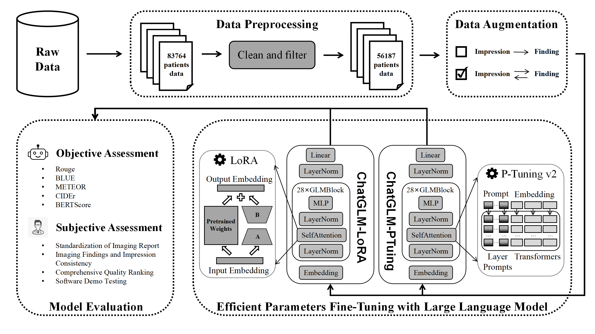

# Imaging Findings Generation Based on Large Language Model

Summary

>**[Manuscript](http://path to paper)** \
> Author Information


## Approach


## Dataset Overview
Originally in the `Data` folder. Since this data is private data for the hospitals, it is not open source.

### Training Data
- A knee joint MRI reports from Peking University Third Hospital, includes 56187 reports.

### Eval Data
- A knee joint MRI reports from Peking University Third Hospital, includes 5000 reports.

### Test Data
- A knee joint MRI reports from Peking University Third Hospital, includes 5000 reports.
- A knee joint MRI reports from Qingdao University Affiliated Hospital, includes 100 reports.
- A knee joint MRI reports from Yantai Yuhuangding Hospital, includes 100 reports.
- A knee joint MRI reports from Hebei Gucheng County Hospital, includes 100 reports.

## Getting Started
### Environment
- python>=3.8
- cuda>=11.6, cuDNN
- transformers>=4.23.1
- Use pip to install dependencies：`pip install -r requirements.txt`

### Model
- [ChatGLM-6B](https://huggingface.co/THUDM/chatglm-6b)

### PEFT Method
- [LoRA](https://arxiv.org/abs/2106.09685)
- [P-Tuning](https://arxiv.org/abs/2110.07602)


## Finetune with Large Language Model

### ChatGLM-6B(LoRA)
#### Train

```bash
python model/LoRA/finetune.py \
    --dataset_path .data/  \
    --lora_rank 8  \
    --per_device_train_batch_size 8  \
    --gradient_accumulation_steps 1  \
    --save_strategy epoch \
    --num_train_epochs 10 \
    --save_total_limit 10  \
    --learning_rate 1e-4  \
    --fp16  \
    --remove_unused_columns false  \
    --logging_steps 10  \
    --output_dir output/LoRA/
```
#### Inference
```bash
python model/LoRA/inference.py
```

### ChatGLM-6B(P-Tuning)
#### Train
```bash
python model/P_Tuning/main.py \
    --do_train \
    --train_file .data/train.json  \
    --test_file .data/test.json \
    --prompt_column instruction \
    --response_column output \
    --overwrite_cache \
    --model_name_or_path /path_to_model/ \
    --output_dir output/P_Tuning/ \
    --overwrite_output_dir \
    --label_smoothing_factor 0 \
    --max_source_length 350 \
    --max_target_length 350 \
    --per_device_train_batch_size 8 \
    --per_device_eval_batch_size 1 \
    --gradient_accumulation_steps 1 \
    --predict_with_generate \
    --num_train_epochs 10 \
    --logging_steps 50 \
    --save_total_limit 10 \
    --save_strategy epoch \
    --learning_rate 2e-2 \
    --pre_seq_len 128 \
    --quantization_bit 4 \
    --num_beams 3
```
#### Inference
```bash
python model/P_Tuning/main.py \
    --do_predict \
    --train_file .data/train.json  \
    --test_file .data/test.json \
    --prompt_column instruction \
    --response_column output \
    --overwrite_cache \
    --model_name_or_path /path_to_model/ \
    --output_dir output/P_Tuning/ \
    --overwrite_output_dir \
    --label_smoothing_factor 0 \
    --max_source_length 350 \
    --max_target_length 350 \
    --per_device_train_batch_size 8 \
    --per_device_eval_batch_size 1 \
    --gradient_accumulation_steps 1 \
    --predict_with_generate \
    --num_train_epochs 10 \
    --logging_steps 50 \
    --save_total_limit 10 \
    --save_strategy epoch \
    --learning_rate 2e-2 \
    --pre_seq_len 128 \
    --quantization_bit 4 \
    --num_beams 3
```

### Citation

```
@article{
Citation Information
}
```

#### Acknowledgements

Acknowledgements Information
